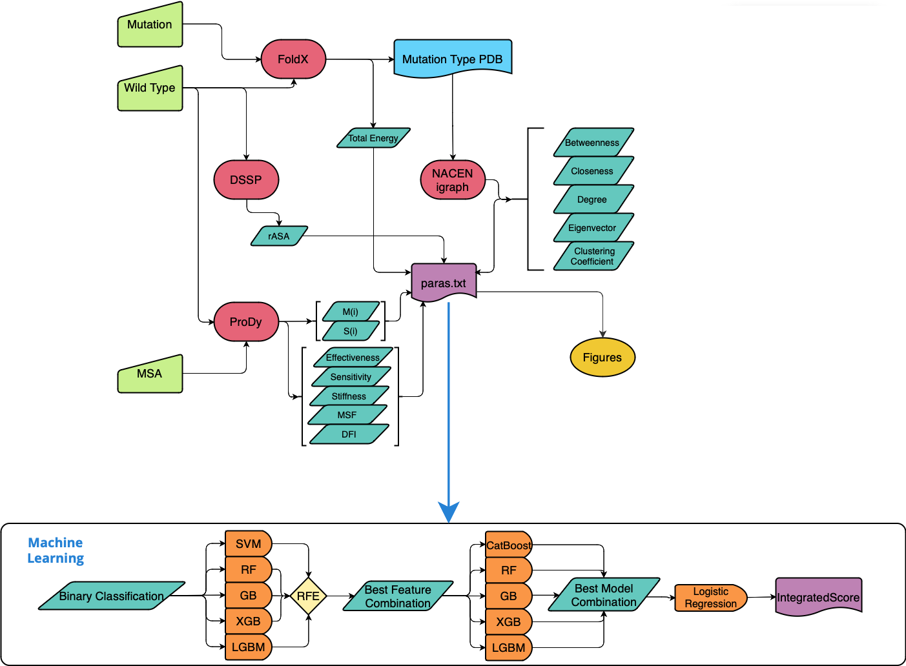
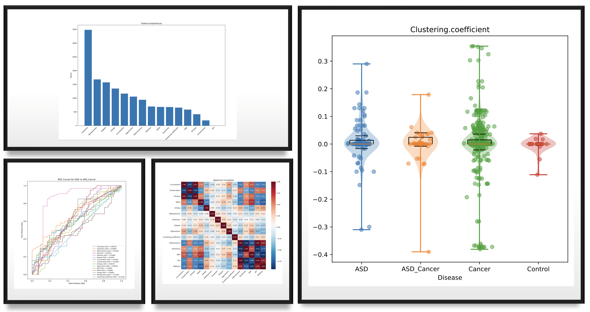

# Auto Protein Mutation Analyzer (AMPA)

The AMPA is intended to calculate the features of protein mutation including Amino Acid Web features
such as Betweenness Closeness etc. and other features like Effectiveness, Stiffness and Entropy, Co.evolution.

Also, a stacking model is built automatically to detect the best model to classify the categories you provide.

It can also give you basic figures

The tool can only operate in Windows system.

See [Run.ipynb](./Run.ipynb) to operate the tool

# Install
- Dependency python = 3.10

- To get the tool, run the following code
```
git clone https://github.com/Spencer-JRWang/APMA
```
- To install the dependency, run the following code
```
pip install .
```
- You should install R in you laptop and add R_Home in your environmental parameter
```
R_HOME = your_route_to_R
```
- Install bio3d, igraph and NACEN package in your R
```
install.packages("bio3d")
```
```
install.pacakges("igraph")
```
The NACEN website: http://sysbio.suda.edu.cn/NACEN

# Message

> 📧: jrwangspencer@stu.suda.edu.cn

> Department of Bioinformatics, Medical School of Soochow University
